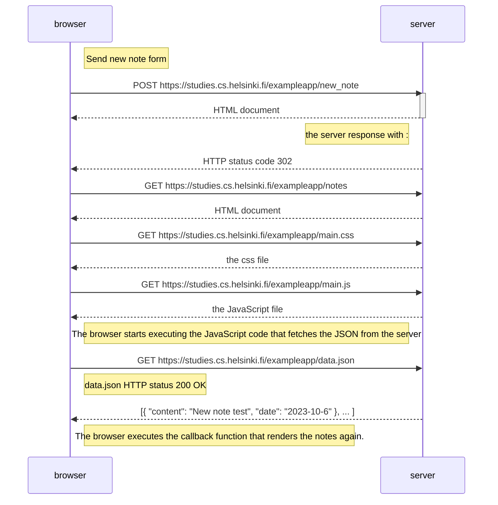

```mermaid
sequenceDiagram
    participant browser
    participant server

    
    Note right of browser: Send new note form

    browser->>server: POST https://studies.cs.helsinki.fi/exampleapp/new_note
    activate server
    server-->>browser: HTML document
    deactivate server

    Note left of server: the server response with :
    server-->>browser: HTTP status code 302

    browser->>server: GET https://studies.cs.helsinki.fi/exampleapp/notes
    server-->>browser: HTML document

    browser->>server: GET https://studies.cs.helsinki.fi/exampleapp/main.css
    server-->>browser: the css file

    browser->>server: GET https://studies.cs.helsinki.fi/exampleapp/main.js
    server-->>browser: the JavaScript file

    Note right of browser: The browser starts executing the JavaScript code that fetches the JSON from the server

    browser->>server: GET https://studies.cs.helsinki.fi/exampleapp/data.json
    Note right of browser: data.json HTTP status 200 OK
    server-->>browser: [{ "content": "New  note test", "date": "2023-10-6" }, ... ]

    Note right of browser: The browser executes the callback function that renders the notes again.

```