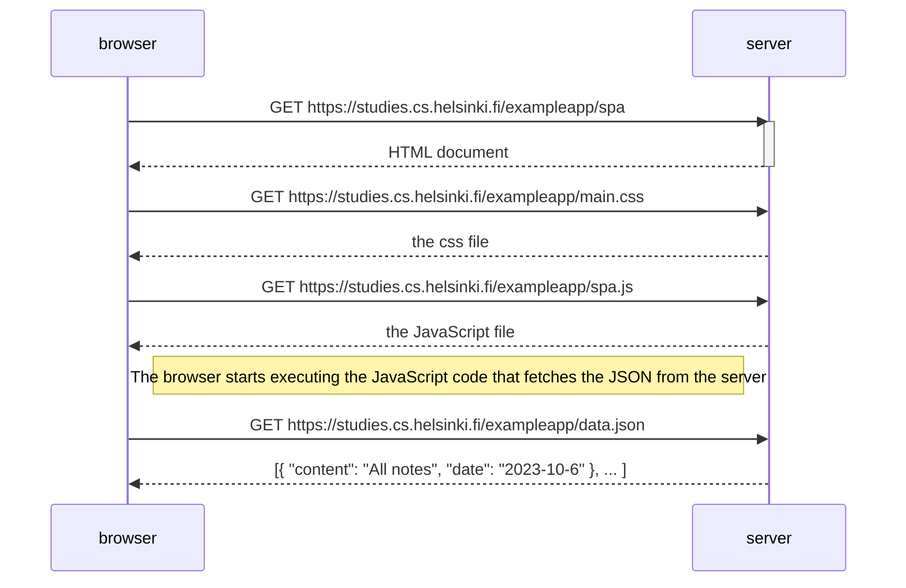

```mermaid
sequenceDiagram
    participant browser
    participant server

    browser->>server: GET https://studies.cs.helsinki.fi/exampleapp/spa
    activate server
    server-->>browser: HTML document
    deactivate server

    browser->>server: GET https://studies.cs.helsinki.fi/exampleapp/main.css
    server-->>browser: the css file

    browser->>server: GET https://studies.cs.helsinki.fi/exampleapp/spa.js
    server-->>browser: the JavaScript file

    Note right of browser: The browser starts executing the JavaScript code that fetches the JSON from the server

    browser->>server: GET https://studies.cs.helsinki.fi/exampleapp/data.json

    server-->>browser: [{ "content": "All notes", "date": "2023-10-6" }, ... ]

```